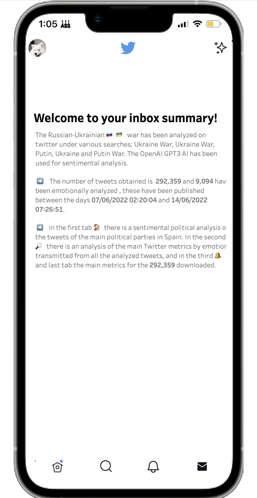

# Russo-Ukranian War Sentiment Analysis

Link al dashbaord [Dashboard](https://public.tableau.com/app/profile/eduardo.arroyo.gil/viz/russo-ukranianwar-politicalsentimentanalysis/Summary?publish=yes)

<!--
*** Thanks for checking out the Best-README-Template. If you have a suggestion
*** that would make this better, please fork the repo and create a pull request
*** or simply open an issue with the tag "enhancement".
*** Don't forget to give the project a star!
*** Thanks again! Now go create something AMAZING! :D
-->

<!-- PROJECT SHIELDS -->
<!--
*** I'm using markdown "reference style" links for readability.
*** Reference links are enclosed in brackets [ ] instead of parentheses ( ).
*** See the bottom of this document for the declaration of the reference variables
*** for contributors-url, forks-url, etc. This is an optional, concise syntax you may use.
*** https://www.markdownguide.org/basic-syntax/#reference-style-links
-->
[![Contributors][contributors-shield]][contributors-url]
[![Forks][forks-shield]][forks-url]
[![Stargazers][stars-shield]][stars-url]
[![Issues][issues-shield]][issues-url]
[![MIT License][license-shield]][license-url]
[![LinkedIn][linkedin-shield]][linkedin-url]

<!-- PROJECT LOGO -->
 

  

  <h3 align="center">Russo-Ukranian War Sentiment Analysis</h3>

[Presentation](https://docs.google.com/presentation/d/1fxxxqB1LBgWhg2PB84cYwxWtmVlDILNVrjqV_6a3i-Y/edit?usp=sharing)

<!-- TABLE OF CONTENTS -->

  
Table of Contents

  <ol>
    <li>
      <a href="#about-the-project">About The Project</a>
      <ul>
        <li><a href="#built-with">Built With</a></li>
      </ul>
    </li>
    <li><a href="#getting-started">Objectives</a></li>
    <li><a href="#usage">Methodology</a></li>
    <li><a href="#roadmap">Repository Structure</a></li>
    <li><a href="#contributing">Conclusions</a></li>
    <li><a href="#contributing">Needed Libraries</a></li>
    <li><a href="#contributing">Contact</a></li>
  </ol>

<!-- ABOUT THE PROJECT -->
## About The Project

  

Este proyecto trata de analizar mediante una inteligencia artificial el sentimiento 
de los tweets emitidos sobre la guerra de ucrania. Principalmente el uso que han dado
los partidos politicos españoles a este tema para usarlo en su beneficio.

Asi como el impacto en la poblacion.

Para ello se han realizado busquedas en twitter bajo los conceptos:

*  Guerra de Ucrania
* Ukraine War
* Putin
* Ucrania
* Guerra Putin

(<a href="#top">back to top</a>)

### Built With

las principales tecnollogias que se han utilizado para la realizacion de este proyecto son:

* Python
* Twitter
* OpenAI - GPT3
* Tableau
* MySQL
* Github

(<a href="#top">back to top</a>)

<!-- Objectives -->
## Objectives

Use this space to show useful examples of how a project can be used. Additional screenshots, code examples and demos work well in this space. You may also link to more resources.

_For more examples, please refer to the [Documentation](https://example.com)_

(<a href="#top">back to top</a>)

<!-- Methodology -->
## Methodology

Use this space to show useful examples of how a project can be used. Additional screenshots, code examples and demos work well in this space. You may also link to more resources.

_For more examples, please refer to the [Documentation](https://example.com)_

(<a href="#top">back to top</a>)

<!-- Repository Structure -->
## Repository Structure

Use this space to show useful examples of how a project can be used. Additional screenshots, code examples and demos work well in this space. You may also link to more resources.

_For more examples, please refer to the [Documentation](https://example.com)_

(<a href="#top">back to top</a>)

<!-- Conclusions -->
## Conclusions

Use this space to show useful examples of how a project can be used. Additional screenshots, code examples and demos work well in this space. You may also link to more resources.

_For more examples, please refer to the [Documentation](https://example.com)_

(<a href="#top">back to top</a>)

<!-- Needed Libraries -->
## Needed Libraries

Use this space to show useful examples of how a project can be used. Additional screenshots, code examples and demos work well in this space. You may also link to more resources.

_For more examples, please refer to the [Documentation](https://example.com)_

(<a href="#top">back to top</a>)

<!-- CONTACT -->
## Contact

Eduardo Arroyo Gil - [LinkedIn](https://www.linkedin.com/in/eduardo-arroyo/) - eduardoarroyogil@gmail.com

Project Link: [https://github.com/EduardoArroyoGil/russo_ukranian_war_nlp_sentiment_analysis](https://github.com/EduardoArroyoGil/russo_ukranian_war_nlp_sentiment_analysis)

(<a href="#top">back to top</a>)

<!-- MARKDOWN LINKS & IMAGES -->
<!-- https://www.markdownguide.org/basic-syntax/#reference-style-links -->
[contributors-shield]: https://img.shields.io/github/contributors/EduardoArroyoGil/russo_ukranian_war_nlp_sentiment_analysis.svg?style=for-the-badge
[contributors-url]: https://github.com/EduardoArroyoGil/russo_ukranian_war_nlp_sentiment_analysis/graphs/contributors
[forks-shield]: https://img.shields.io/github/forks/EduardoArroyoGil/russo_ukranian_war_nlp_sentiment_analysis.svg?style=for-the-badge
[forks-url]: https://github.com/EduardoArroyoGil/russo_ukranian_war_nlp_sentiment_analysis/network/members
[stars-shield]: https://img.shields.io/github/stars/EduardoArroyoGil/russo_ukranian_war_nlp_sentiment_analysis.svg?style=for-the-badge
[stars-url]: https://github.com/EduardoArroyoGil/russo_ukranian_war_nlp_sentiment_analysis/stargazers
[issues-shield]: https://img.shields.io/github/issues/EduardoArroyoGil/russo_ukranian_war_nlp_sentiment_analysis.svg?style=for-the-badge
[issues-url]: https://github.com/EduardoArroyoGil/russo_ukranian_war_nlp_sentiment_analysis/issues
[license-shield]: https://img.shields.io/github/license/EduardoArroyoGil/russo_ukranian_war_nlp_sentiment_analysis.svg?style=for-the-badge
[license-url]: https://github.com/EduardoArroyoGil/russo_ukranian_war_nlp_sentiment_analysis/blob/master/LICENSE.txt
[linkedin-shield]: https://img.shields.io/badge/-LinkedIn-black.svg?style=for-the-badge&logo=linkedin&colorB=555
[linkedin-url]: https://www.linkedin.com/in/eduardo-arroyo/
[product-screenshot]: images/readme/screenshot_project.png
