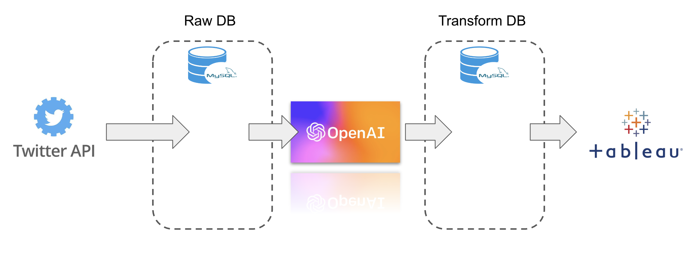

# Russo-Ukranian War Sentiment Analysis

<!--
*** Thanks for checking out the Best-README-Template. If you have a suggestion
*** that would make this better, please fork the repo and create a pull request
*** or simply open an issue with the tag "enhancement".
*** Don't forget to give the project a star!
*** Thanks again! Now go create something AMAZING! :D
-->

<!-- PROJECT SHIELDS -->
<!--
*** I'm using markdown "reference style" links for readability.
*** Reference links are enclosed in brackets [ ] instead of parentheses ( ).
*** See the bottom of this document for the declaration of the reference variables
*** for contributors-url, forks-url, etc. This is an optional, concise syntax you may use.
*** https://www.markdownguide.org/basic-syntax/#reference-style-links
-->
[![Contributors][contributors-shield]][contributors-url]
[![Forks][forks-shield]][forks-url]
[![Stargazers][stars-shield]][stars-url]
[![Issues][issues-shield]][issues-url]
[![MIT License][license-shield]][license-url]
[![LinkedIn][linkedin-shield]][linkedin-url]

<!-- PROJECT LOGO -->
 

  

  <h3 align="center">Russo-Ukrainian War Sentiment Analysis</h3>

<!-- TABLE OF CONTENTS -->

  
Table of Contents

  <ol>
    <li>
      <a href="#about-the-project">About The Project</a>
      <ul>
        <li><a href="#built-with">Built With</a></li>
      </ul>
    </li>
    <li><a href="#objectives">Objectives</a></li>
    <li><a href="#methodology">Methodology</a></li>
    <li><a href="#repository-structure">Repository Structure</a></li>
    <li><a href="#conclusions">Conclusions</a></li>
    <li><a href="#needed-libraries">Needed Libraries</a></li>
    <li><a href="#contact">Contact</a></li>
  </ol>

<!-- ABOUT THE PROJECT -->
## About The Project

  

This project tries to analyze through artificial intelligence the feeling
of the tweets issued about the war in Ukraine. Mainly the use they have given
Spanish political parties to this issue to use it to their advantage.
As well as the impact on the population.

For this, searches have been made on twitter under the concepts:

* Guerra de Ucrania
* Ukraine War
* Putin
* Ucrania
* Guerra Putin

Link to final [Dashboard](https://public.tableau.com/app/profile/eduardo.arroyo.gil/viz/russo-ukranianwar-politicalsentimentanalysis/Summary?publish=yes)

(<a href="#top">back to top</a>)

### Built With

The main technologies that have been used to carry out this project are: concepts:

* Python
* Twitter
* OpenAI - GPT3
* Tableau
* MySQL
* Github

(<a href="#top">back to top</a>)

<!-- Objectives -->
## Objectives

**Reason**: Interest on Politics and its relation with the psychology and the complexity of the Language and its connection with the reality.

**Objective**: Analyse the Russo-Ukrainian War usage on Twitter by the Politician & Political Parties and general public

(<a href="#top">back to top</a>)

<!-- Methodology -->
## Methodology

The methodology to get the final solution is explained in the following image:

(<a href="#top">back to top</a>)

<!-- Repository Structure -->
## Repository Structure

The folder that manage the whole project are:
* **credentials**: where vevry token or credential is stored under the .env file.
* **dashboard**: where tableau dashboards are stored.
* **data**: every data generated, used or read is stored in here.
  * **master_data**: the master data manually obtained.
  * **production**: production data which is stored in DB.
  * **sample**: a sample of production data to test goals.
  * **sandbox**: a sandbox folder to generate dirty data and dummy data.
* **elts**: the main etls that make the project easier to run and mange, connections to twitter, data base & OpenAI and the main transformations layers.
* **images**: images used for the whole project.
  * **presentation**: images used for the [presentation](https://docs.google.com/presentation/d/1fxxxqB1LBgWhg2PB84cYwxWtmVlDILNVrjqV_6a3i-Y/edit?usp=sharing).
  * **readme**: images used for this readme file.
* **logs**: folder to store every log of each run.
* **openai_module**: module where every main functions and classes to connect to OpenAI API and transformation based on it.
* **twitter_module**: module where every main functions and classes to connect to Twitter API and transformation based on it.
* **transformer_module**: module where every transformer is stored and the code to generate them (next steps of the project).
* **tools**: the main tools developed for make the project more agile
  * **db**: tool to connect, write and read from data base.

(<a href="#top">back to top</a>)

<!-- Conclusions -->
## Conclusions

The two most active political parties on Twitter are PSOE and VOX:

PSOE may be for being in government, however VOX would not be explained by this.

The use that the PSOE makes of this topic is by making comments that convey emotions typically classified as positive or order-oriented and VOX negative or disorder-oriented. This can be explained because VOX does not govern and the PSOE does and the intentions of each one of them are the opposite.

We see that there is a clear tendency towards two sentiments in a generic way, Anger and Pride, from the part of the general public. This may be explained by the polarization also observed in political parties. However, we cannot guarantee that:
* Political tweets influence general opinion
* General public tweets influence political tweets
* Both at the same time

(<a href="#top">back to top</a>)

<!-- Needed Libraries -->
## Needed Libraries

Main libraries to develop this project in python are:
* **pandas**: to manage dataframes
* **openai**: to connect to OpenAI GPT3 API
* **request**: to connect to APIs
* **tweepy**: to connect to Twitter API
* **tqdm**: to understand how much time code will take in each launch
* **time**: for time calculus
* **dotenv**: to manage .env files
* **SQLAlchemy**: to connect to data base
* **logging**: to manage the logs of the code

(<a href="#top">back to top</a>)

<!-- CONTACT -->
## Contact

Eduardo Arroyo Gil - [LinkedIn](https://www.linkedin.com/in/eduardo-arroyo/) - eduardoarroyogil@gmail.com

Project Link: [https://github.com/EduardoArroyoGil/russo_ukranian_war_nlp_sentiment_analysis](https://github.com/EduardoArroyoGil/russo_ukranian_war_nlp_sentiment_analysis)

This project has been explained deeper in this [Presentation](https://docs.google.com/presentation/d/1fxxxqB1LBgWhg2PB84cYwxWtmVlDILNVrjqV_6a3i-Y/edit?usp=sharing)

(<a href="#top">back to top</a>)

<!-- MARKDOWN LINKS & IMAGES -->
<!-- https://www.markdownguide.org/basic-syntax/#reference-style-links -->
[contributors-shield]: https://img.shields.io/github/contributors/EduardoArroyoGil/russo_ukranian_war_nlp_sentiment_analysis.svg?style=for-the-badge
[contributors-url]: https://github.com/EduardoArroyoGil/russo_ukranian_war_nlp_sentiment_analysis/graphs/contributors
[forks-shield]: https://img.shields.io/github/forks/EduardoArroyoGil/russo_ukranian_war_nlp_sentiment_analysis.svg?style=for-the-badge
[forks-url]: https://github.com/EduardoArroyoGil/russo_ukranian_war_nlp_sentiment_analysis/network/members
[stars-shield]: https://img.shields.io/github/stars/EduardoArroyoGil/russo_ukranian_war_nlp_sentiment_analysis.svg?style=for-the-badge
[stars-url]: https://github.com/EduardoArroyoGil/russo_ukranian_war_nlp_sentiment_analysis/stargazers
[issues-shield]: https://img.shields.io/github/issues/EduardoArroyoGil/russo_ukranian_war_nlp_sentiment_analysis.svg?style=for-the-badge
[issues-url]: https://github.com/EduardoArroyoGil/russo_ukranian_war_nlp_sentiment_analysis/issues
[license-shield]: https://img.shields.io/github/license/EduardoArroyoGil/russo_ukranian_war_nlp_sentiment_analysis.svg?style=for-the-badge
[license-url]: https://github.com/EduardoArroyoGil/russo_ukranian_war_nlp_sentiment_analysis/blob/master/LICENSE.txt
[linkedin-shield]: https://img.shields.io/badge/-LinkedIn-black.svg?style=for-the-badge&logo=linkedin&colorB=555
[linkedin-url]: https://www.linkedin.com/in/eduardo-arroyo/
[product-screenshot]: images/readme/screenshot_project.png
